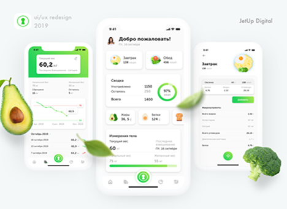

# nutriApp
## Documentacion de Aplicacion
### Objetivo
Hacer saber a la comunidad como cuidarse de manera saludable mediante una aplicacion de nutricion.
#### Integrantes
##### Nombre Completo:Jimenez Martinez Neyda Nahomi
###### Correo Electronico:[23308060610175@cetis61.edu.mx]
###### Institucion:[CETis61]

#### Nombre completo:Rangel Palacios Brisa
##### correo Electronico:[23308060610256@cetis61.edu.mx]
###### Institucion:[CETis61]

###### Analisis de Base de Datos

---

# INTRODUCCIÓN

Este informe presenta un análisis de mercado de aplicaciones nutricionales existentes, el diseño de una encuesta para recopilar datos de usuarios potenciales, resultados simulados de muestra y recomendaciones para el desarrollo de una futura aplicación nutricional.

---

## OBJETIVOS DE LA INVESTIGACIÓN

- Analizar funcionalidades, experiencia de usuario y modelos de negocio de aplicaciones nutricionales populares.  
- Comparar sus ventajas, desventajas y características innovadoras.  
- Identificar brechas de mercado o mejoras potenciales para un nuevo producto.  
- Preparar base para luego recopilar datos directos de usuarios potenciales (mediante encuesta) para validar necesidades y preferencias.

---

## METODOLOGÍA

Se realizó revisión documental de fuentes públicas (sitios oficiales y análisis especializados) para el análisis de aplicaciones.  
Seleccionamos 3 aplicaciones móviles/web de nutrición representativas (gratuitas, premium, pago) para análisis individual.  
Comparación mediante tabla resumen para destacar similitudes y diferencias.

Se diseñó una encuesta de 15 preguntas (abiertas y cerradas) y se generaron 30 respuestas simuladas para demostrar análisis estadístico y visualización.  
**Importante:** los datos de encuesta son *SIMULADOS* y deben ser reemplazados por respuestas reales tras la distribución.

---

## ANÁLISIS DE APLICACIONES

Las tres apps analizadas son:

1. **MyFitnessPal**  
2. **FatSecret**  
3. **Cronometer**

---

### MyFitnessPal

#### Funcionalidades principales
- Amplísima base de datos de alimentos (más de 11 millones de alimentos) que permite registrar comidas, escanear códigos de barras, búsqueda de alimentos de restaurante.  
- Registro de comidas, macros (carbohidratos, grasas, proteínas), y seguimiento de peso, ejercicio, medidas corporales.  
- Funciones avanzadas en versión Premium/Premium+: planificador de comidas, listas de compras, integración más rápida de logging, objetivos personalizados.  
- También recientemente añadió **“Weekly Habits”** (hábitos semanales) y sugerencias de alimentos por dietas (vegan, vegetariano, pescatariano) como parte de la actualización 2025.

#### Experiencia de usuario (UX)
- Interfaz ya muy conocida, establecida, con muchas funcionalidades; lo que puede implicar curva de aprendizaje para nuevos usuarios.  
- Buen diseño de búsqueda, escaneo de alimentos, logueo rápido de comidas.  
- Algunas críticas en foros indican que la experiencia en Android/iOS tiene bugs, ciertas integraciones no tan pulidas, interfaz algo pesada.  
- La actualización reciente añade elementos de gamificación/hábitos, lo que puede mejorar el *engagement*.

#### Modelo de negocio
- Versión gratuita con funcionalidades básicas (registro de alimentos, ejercicio, peso, macros).  
- Versión Premium / Premium+ mediante suscripción con funciones adicionales (Meal Planner, listas de compras, personalización avanzada, sin anuncios).  
- **Freemium** claramente; la gran base de usuarios permite monetizar mediante suscripción.

#### Puntos fuertes
- Gran base de datos de alimentos, lo que facilita el registro rápido.  
- Ecosistema maduro, gran cantidad de usuarios, integraciones con otros dispositivos/apps de fitness.  
- Funciones avanzadas para personalización y seguimiento detallado.  
- Buena reputación y visibilidad en el mercado.

#### Debilidades
- Muchas funciones avanzadas están detrás de la suscripción, lo cual puede limitar usuarios que solo quieren lo básico.  
- Base de datos tan amplia que en algunos casos incluye entradas erróneas (usuario-generadas).  
- Puede resultar abrumadora para usuarios principiantes.  
- Algunas críticas por bugs o soporte limitado.  
- Cierta saturación de funciones puede afectar la simplicidad.

#### Características innovadoras
- La nueva función **“Weekly Habits”** para fomentar hábitos semanales estructurados.  
- Logging de comidas mediante escaneo de código de barras o búsqueda rápida.  
- Planificador de comidas, listas de compra y recetas en la versión prémium.  
- Integración con múltiples dispositivos/apps del ecosistema de salud/fitness.

---

### FatSecret

#### Funcionalidades principales
- Contador de calorías, registro de alimentos con base de datos verificada (>1.9 millones de alimentos) para seguimiento preciso.  
- Escáner de código de barras para ingreso rápido de alimentos.  
- Registro de macronutrientes (y agua en la versión Premium), progresos en peso y gráficos de tendencia.  
- Comunidad de soporte, retos y logros (“achievements & streaks”) para motivación del usuario.  
- Versión Premium que añade funcionalidades como **“Smart Food Scan”** (reconocimiento de alimentos a partir de foto), planificador de comidas, etc.

#### Experiencia de usuario
- Interfaz relativamente sencilla, claro enfoque en conteo de calorías y macros, lo que la hace accesible para muchos usuarios.  
- Buen soporte de comunidad y motivación social, lo que favorece adherencia.  
- Algunas reseñas señalan que la base de datos, aunque grande, puede presentar inconsistencias en algunos alimentos o marcas menos comunes.

#### Modelo de negocio
- Versión gratuita con las funciones básicas suficientes para registro de alimentos, macros y peso.  
- Versión Premium mediante suscripción que desbloquea funcionalidades premium (Smart Food Scan, planificador, sin anuncios, etc.).

#### Puntos fuertes
- Base de datos verificada de alimentos (1.9 millones), lo cual aporta precisión.  
- Escáner de código de barras y registro bastante rápido.  
- Comunidad integrada como motivador social.  
- Buena opción “gratuita” para muchas funcionalidades básicas sin necesidad de pagar.

#### Debilidades
- Funciones avanzadas **premium** requieren suscripción; algunos usuarios sienten que funcionalidades importantes están bloqueadas.  
- Poca visibilidad de características innovadoras fuera del conteo de alimentos y macros (aunque están trabajando en ello).  
- Algunos problemas puntuales de sincronización con otras apps/dispositivos (por ejemplo, usuarios reportan duplicados al sincronizar con Google Fit).

#### Características innovadoras
- **Smart Food Scan** (foto del plato para estimar porciones y nutrientes) disponible en Premium.  
- Enfoque en comunidad, logros y motivación diaria (“achievements & streaks”) para fomentar hábitos.  
- **API de alimentos/verificación de alimentos** para desarrolladores, lo que denota que tienen un backend robusto de datos nutricionales.

